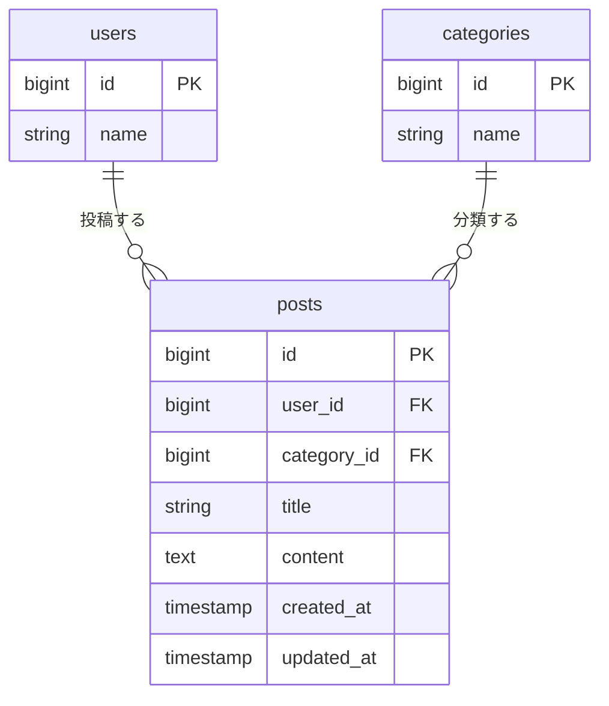
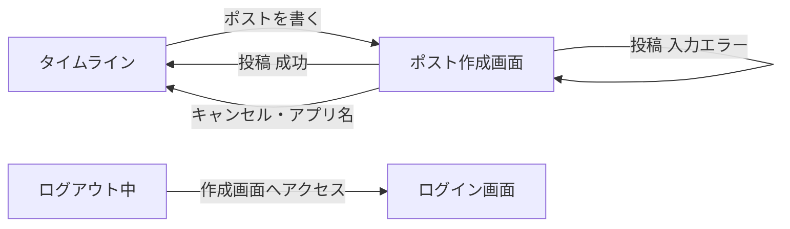

> この設計書は、この機能を実装した時点の記録です。このあとは更新していません。

# ポスト新規作成機能 設計書

Issue: https://github.com/basstuba/post-app-practice/issues/3

## 概要

今のアプリは既存のポストを読む・編集する・削除することはできるが、新しいポストを書く手段がない(新規投稿のルートが無い)。ログインしたユーザーが自分でポストを書けるように、ポストの新規作成機能を追加する。

- ポストを書く画面(作成画面)を新しく作る。入力する項目は編集画面と同じく、タイトル・トピック・本文の3つ
- タイムラインに、作成画面へ移る「ポストを書く」リンクを足す
- 作成できるのはログインしているユーザーだけ。投稿者は書いた本人で、他の人の名前では投稿できない
- `posts` テーブルの列は増やさない。ポストの編集・削除、リプライ機能は今のまま

### 決めたこと

| 項目 | 内容 |
| :--- | :--- |
| 入口 | タイムラインのヘッダー(「ホーム」の行の右端)に「ポストを書く」リンクを足し、作成画面へ移る。タイムラインに入力フォームは置かない |
| 画面 | 作成画面を別に作る。編集画面(`posts.edit`)と同じ作りにする |
| 入力する項目 | タイトル・トピック・本文。編集画面と同じ |
| トピックの初期状態 | 先頭に「選択してください」(値は空)を置く。選ばずに送るとエラーにする。先頭のトピックが気づかないまま選ばれるのを防ぐ |
| 本文 | 必須・140字以内。ポストの更新と同じく、`\r\n` を `\n` にそろえてから数える。編集画面と同じ「残り文字数」の表示を付ける |
| タイトル | 必須・255字以内(ポストの更新と同じ) |
| 投稿者 | ログイン中のユーザーを `user_id` に入れる。リクエストに `user_id` が含まれていても受け取らない |
| 送信後 | タイムラインに戻る(編集・削除の後と同じ)。新しいポストが先頭に見える |
| エラーのとき | 作成画面に戻り、入力した内容を残してエラーを入力欄の下に出す |
| 認可 | ログインしているだけでよい。`PostPolicy` に `create` は足さない(ログインしていれば誰でも作れるので、`auth` ミドルウェアで足りる) |
| 入力チェックの置き場所 | 送信を受けるコントローラーの中の `validate()`。FormRequest は使わない(既存の書き方に合わせる) |
| 本文の共通ルール | `PostController` が使っている `ValidatesContent`(本文のルールと文言)をそのまま使う |
| HTML の `required` 属性 | 3つの入力欄とも付けない。ブラウザの確認に先に止められず、サーバー側のエラーを必ず表示するため(リプライと同じ判断) |

## 受け入れ条件

- [ ] ログインした状態でタイムラインを開くと、ポストを書く場所か、書く画面への入口がある
- [ ] タイトル・トピック・本文を入れて送ると、タイムラインの先頭にそのポストが増える
- [ ] 本文が空のまま送ると、エラーが表示されてポストは増えない
- [ ] 増えたポストには自分の名前が出ていて、編集と削除の操作が出る
- [ ] ログアウトすると、ポストを書く場所にたどり着けない(ログイン画面に飛ばされる)

## 変えないもの

- `posts` テーブルの列。カラム追加はしない。マイグレーションも足さない
- タイムラインの一覧・編集・削除。表示順(新しい順)、本文の見え方、編集・削除・返信ボタンの出る条件、ポストの編集・削除の入力チェックの判定と認可は、そのままにする。タイムラインに足してよいのは、ヘッダーの「ポストを書く」リンクだけ
- `PostPolicy` の中身。更新・削除は投稿者本人だけのまま
- リプライ機能(ポスト1件の画面、リプライの送信・削除、`ReplyPolicy`)
- 編集画面の文字数制限(本文140字以内)と残り文字数の表示。編集画面のファイルは触らない。作成画面の残り文字数は、編集画面と同じ見た目・同じ数え方で、作成画面の側に持たせる
- 本文の共通ルール(`ValidatesContent`)の中身。文言「本文は140字以内で入力してください。」と、既存のテスト(`PostContentLimitTest`)の期待値はそのまま
- ログイン・ユーザー登録の仕組み(Fortify)と、ログイン後の遷移先(`/posts`)
- 認証が必要なルートは、これまでどおり `auth` ミドルウェアのグループに入れる

## 増えるテーブル

増えるテーブルは無い。既存の `posts` に1行ずつ足すだけで、列も変えない。

### ER図

関係の説明に必要な列だけを描いている(リプライは今回関係しないので省いた)。

### posts(ポスト)に入れる値

| カラム名 | 入れる値 | 入力する人 |
| :------- | :------- | :--------- |
| user_id | ログイン中のユーザーの `id` | 入力しない(サーバーが決める) |
| category_id | 選ばれたトピックの `id` | 画面で選ぶ |
| title | 入力されたタイトル | 画面で入力する |
| content | 入力された本文(改行は `\n` にそろえたもの) | 画面で入力する |
| created_at / updated_at | 作成した日時 | 入力しない(Laravel が入れる) |

- 「投稿者は書いた本人」は、`user_id` を画面から受け取らず、サーバーで `auth()->id()` を入れることで守る
- 140字の上限は、DB の列ではなく入力チェックで守る(今の `content` と同じやり方)

### 追加・変更されるクラス(コードはまだ書かない)

| 種類 | 名前 | 役割 |
| :--- | :--- | :--- |
| コントローラー | `PostController`(変更) | 作成画面を出す `create` と、ポストを保存する `store` を足す |
| ビュー | `resources/views/posts/create.blade.php`(新規) | 作成画面。レイアウト継承なし・CSS はファイル内の `<style>` に書く、という既存の流儀に合わせる |
| ビュー | `resources/views/posts/index.blade.php`(変更) | ヘッダーに「ポストを書く」リンクを足す |
| ルート | `routes/web.php`(変更) | `create` と `store` の2本を `auth` グループに足す |
| モデル・ポリシー | 変更なし | `Post` の `$fillable` に `user_id` などが既にあるため。`PostPolicy` も触らない |

## 増える画面

### ポスト作成画面(`posts.create`)

| 項目 | 内容 |
| :--- | :--- |
| URL | `GET /posts/create` |
| 役割 | 新しいポストのタイトル・トピック・本文を入力して送る |
| 利用者 | ログイン済みのユーザー。未ログインの場合は、ログイン画面へ送る |
| 入口 | タイムラインの「ポストを書く」リンク。入力エラーで戻ってくる場合もある |
| 出口 | 送信に成功するとタイムラインへ。「キャンセル」とアプリ名でもタイムラインへ戻れる |

画面の並び(上から):

1. ヘッダー(アプリ名)と画面の見出し「ポストを書く」。編集画面と同じ作り
2. タイトル → トピック → 本文(残り文字数付き)の順の入力欄
3. 送信ボタンとキャンセル

画面の項目:

| 項目 | 内容 |
| :--- | :--- |
| タイトル | 1行の入力欄。エラーのときは入力した内容を残す |
| トピック | 選択式。先頭は「選択してください」(値は空)、その下にカテゴリを `id` 順で並べる。エラーのときは選んだ内容を残す |
| 本文 | 複数行の入力欄。エラーのときは入力した内容を残す |
| 残り文字数 | 本文の下に「残り○字」と出す。超えると「○字オーバー」と赤字にする。数え方は編集画面と同じ(絵文字などは1字、改行は1字)。`maxlength` は付けず、超過はサーバーの入力チェックに任せる |
| エラー表示 | 各入力欄の下に赤字で出す(編集画面と同じ) |
| 投稿ボタン | 「投稿する」。押すと `POST /posts` |
| キャンセル | タイムラインへ戻るリンク(入力した内容は保存しない) |

### 既存画面の変更(新しい画面ではない)

| 画面 | 変更 |
| :--- | :--- |
| タイムライン(`posts.index`) | ヘッダーの「ホーム」の行の右端に「ポストを書く」リンクを足す。ポストの並びや各ポストの操作は変えない。ポストが1件もないとき(「まだポストがありません。」)でも、リンクはヘッダーにあるので出る |

### 画面遷移

### ルート

| 操作 | メソッドとURL | 名前 | 認可 |
| :--- | :------------ | :--- | :--- |
| 作成画面を開く | GET /posts/create | `posts.create` | ログイン済みなら誰でも |
| ポストを保存する | POST /posts | `posts.store` | ログイン済みなら誰でも |

- どちらも `auth` ミドルウェアのグループに入れる。未ログインはログイン画面へ送られる
- **`GET /posts/create` は、`GET /posts/{post}`(`posts.show`)より前に書く。** 後に書くと `create` が `{post}` に当たってしまい、「ID が `create` のポスト」を探して404になる

## 入力チェックとメッセージ一覧

### 入力チェック

| 画面 | 項目 | 必須 | 文字数・形式 | 備考 |
| :--- | :--- | :--- | :----------- | :--- |
| ポスト作成画面 | タイトル | 必須 | 255字以内 | ポストの更新と同じ |
| ポスト作成画面 | トピック | 必須 | `categories` に存在する `id` | 「選択してください」(空)で送るとエラー。存在しない `id` もエラー |
| ポスト作成画面 | 本文 | 必須 | 140字以内 | `\r\n` を `\n` にそろえてから数える。空白だけの本文は、Laravel の既定の扱い(前後の空白を取り除いた結果が空なら「空」)に従う |

- 送信は、ログインしていなければ入力チェックより前にログイン画面へ送る
- 画面から `user_id` を送られても無視する。保存する `user_id` は、検証済みの値ではなく、ログイン中のユーザーの `id` から決める

### メッセージ一覧

| 画面 | でる場面 | 区分 | メッセージ |
| :--- | :------- | :--- | :--------- |
| ポスト作成画面 | タイトルが空のまま送信した | エラー | タイトルを入力してください。 |
| ポスト作成画面 | タイトルが255字を超えている | エラー | タイトルは255文字以内で入力してください。 |
| ポスト作成画面 | トピックを選ばずに送信した | エラー | トピックを選択してください。 |
| ポスト作成画面 | 存在しないトピックの `id` を送った(URL や画面を直接いじった場合など) | エラー | 選択されたトピックは正しくありません。 |
| ポスト作成画面 | 本文が空のまま送信した | エラー | 本文を入力してください。 |
| ポスト作成画面 | 本文が140字を超えている | エラー | 本文は140字以内で入力してください。 |

- 「トピックを選択してください。」は、言語ファイルの `required` の訳(「…を入力してください。」)だと選択式の欄に合わないので、`validate()` の第2引数で `category_id.required` に指定する。この文言は `store` と `update` で共通のメソッドに持つ。編集画面のトピックは空にならないので、画面からの操作では何も変わらない(作った不正なリクエストでトピックを空にした場合だけ、この文言になる)
- 「本文は140字以内で入力してください。」は、ポストの更新と同じく `ValidatesContent` の文言を使う。ポストの編集と文言を同じにし、既存のテストの期待値も変えないため
- それ以外は、`lang/ja/validation.php` の訳と項目名(`title` → タイトル、`category_id` → トピック、`content` → 本文)から作られる。言語ファイルは変えない
- エラーの表示は、既存の編集画面と同じく入力欄の下に赤字で出す
- 成功したときのメッセージ(「投稿しました」など)は出さない。タイムラインの先頭に増えること自体が結果の確認になる

## テスト観点

Feature テストで確認する。DB を使うので `RefreshDatabase` を使う。テストの形式は `ReplyTest` に合わせる(`#[Test]` 属性・メソッド名は日本語)。ポストの用意は `PostFactory`、トピックは `CategoryFactory` を使う。

### 受け入れ条件に対応するもの

| # | 観点 | 期待する結果 |
| :-- | :--- | :----------- |
| 1 | ログインしてタイムラインを開く | 「ポストを書く」リンクが表示され、リンク先は作成画面(`posts.create`)になっている |
| 2 | ログインして作成画面を開く | タイトル・トピック・本文の入力欄と、「投稿する」ボタンが表示される。トピックの選択肢は、先頭の「選択してください」とカテゴリ全件になっている |
| 3 | タイトル・トピック・本文を入れて送信する | ポストが1件増え、タイトル・トピック・本文が送った内容になり、タイムラインへリダイレクトされる |
| 4 | 送信後にタイムラインを開く | 新しいポストが先頭に表示される(他のポストより上) |
| 5 | 本文を空にして送信する | エラー「本文を入力してください。」が表示され、ポストは増えない |
| 6 | 送信後のタイムラインで、増えたポストを見る | 投稿者名が自分の名前で、編集と削除の操作が出る |
| 7 | 未ログインで、作成画面を開く | ログイン画面へリダイレクトされる |
| 8 | 未ログインで、`POST /posts` を送る | ログイン画面へリダイレクトされ、ポストは増えない |

### 境界・認可・その他

| # | 観点 | 期待する結果 |
| :-- | :--- | :----------- |
| 9 | 送ったポストの投稿者 | 送った本人(`user_id` がログイン中のユーザーの `id`)になる |
| 10 | リクエストに他のユーザーの `user_id` を含めて送信する | 無視され、投稿者はログイン中のユーザーになる。他のユーザーの名前では投稿できない |
| 11 | タイトルを空にして送信する | エラー「タイトルを入力してください。」が表示され、ポストは増えない |
| 12 | タイトルがちょうど255字 / 256字で送信する | 255字は送信できる / 256字はエラーになり、ポストは増えない |
| 13 | トピックを選ばず(空で)送信する | エラー「トピックを選択してください。」が表示され、ポストは増えない |
| 14 | 存在しないトピックの `id` で送信する | エラーになり、ポストは増えない |
| 15 | 本文がちょうど140字 / 141字で送信する | 140字は送信できる / 141字はエラー「本文は140字以内で入力してください。」になり、ポストは増えない |
| 16 | 改行を含む本文(ブラウザは `\r\n` で送る)で、改行を含めてちょうど140字 | 送信できる(改行は1字として数える)。保存される本文の改行は `\n` |
| 17 | 空白だけの本文で送信する | エラーになり、ポストは増えない |
| 18 | 入力エラーで戻ったとき | 入力したタイトル・選んだトピック・本文が残っている |
| 19 | `GET /posts/create` を開く | 404にならず、作成画面が開く(`posts.show` に取られていない) |
| 20 | 作成画面の HTML を見る | 3つの入力欄に `required` 属性が付いていない |
| 21 | 作成画面の本文欄 | 残り文字数の表示がある(初期表示は「残り140字」、エラーで戻ったときは入力済みの文字数を引いた値) |

### 既存の動きが変わっていないことの確認

| # | 観点 | 期待する結果 |
| :-- | :--- | :----------- |
| 22 | タイムラインを開く | 今までどおり、新しい順にポストが並ぶ。各ポストに「返信」リンクが出て、自分のポストには今までの編集・削除も出る |
| 23 | 他人のポストの編集・削除 | 今までどおり、編集・削除ボタンは出ず、URL を直接叩いても403になる |
| 24 | ポストの編集 | 今までどおり、本文140字以内などの入力チェックが働き、編集画面の残り文字数の表示も変わらない |
| 25 | リプライの送信・削除、ポスト1件の画面 | 今までどおり動く(`ReplyTest` がすべて通る) |
| 26 | 作成したポストにリプライをつける | 作成したポストの `posts.show` が開き、リプライを送れる |
| 27 | 既存のテスト(`PostContentLimitTest`、`ReplyTest` など)をすべて流す | すべて通る |
