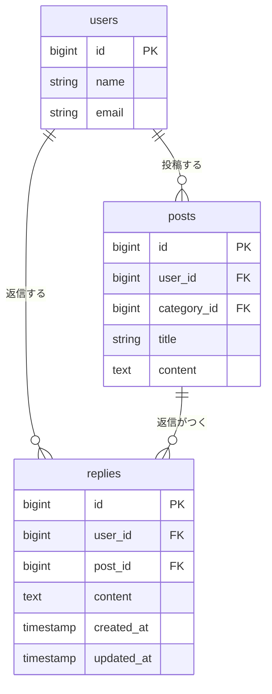
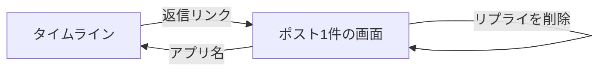

# リプライ機能 設計書

Issue: https://github.com/basstuba/post-app-practice/issues/1

## 概要

今のアプリはポストを読むだけで、返す手段がない。ポストを読んだ人がその場で一言返せるように、ポストに対するリプライ機能を追加する。

- ポスト1件の画面を新しく作り、そのポストとリプライの一覧、リプライの送信フォームを置く
- タイムラインの各ポストに「返信」リンクを足し、ポスト1件の画面へ移れるようにする
- リプライは常にポストに直接つく平らな一覧とする。リプライへのリプライ(入れ子)、リプライの編集、通知は今回やらない
- リプライを送る・消すには、ログインが必要

### 決めたこと

| 項目 | 内容 |
| :--- | :--- |
| 入口 | タイムラインの各ポストの 編集/削除 と同じ行に「返信」リンクを足す。自分・他人どちらのポストにも出す。ポスト本体はリンクにしない |
| 並び順 | 古い順。送信すると一覧の末尾に増える |
| 本文 | 必須・140字以内。ポストの本文と同じく、`\r\n` を `\n` にそろえてから数える |
| 送信後・削除後 | ポスト1件の画面に戻る |
| 削除できる人 | リプライの投稿者本人のみ。ポストの持ち主でも、他人のリプライは消せない |
| 認可のやり方 | `PostPolicy` と同じ。`ReplyPolicy` を新しく作り、投稿者本人かどうか(`user_id` の一致)で判定する。ポリシーは命名規約による自動検出に任せ、画面側は `@can` でボタンの表示を切り替える |
| ポストが削除されたとき | そのポストのリプライも一緒に消える |
| ユーザーが削除されたとき | そのユーザーのリプライも一緒に消える |
| 入力チェックの置き場所 | 送信を受けるコントローラーの中の `validate()`。FormRequest は使わない(既存の書き方に合わせる) |
| 言語設定 | アプリの言語設定を `ja` にする(リプライ機能の範囲外の、付随する変更。下の「付随して行うこと」を参照) |

### 付随して行うこと(機能の範囲外)

リプライ本文の「空です」のエラーを日本語で出すために、アプリの言語設定を `en` から `ja` に変える。機能の範囲外だが、リプライのエラー表示がこれに依存するので、同じブランチで一緒に行う。

| 項目 | 内容 |
| :--- | :--- |
| 変えるもの | `config/app.php` の `locale` を `ja` にする。`fallback_locale`(`en`)と `faker_locale`(`en_US`)は変えない |
| 足すもの | 入力チェックの日本語訳 `lang/ja/validation.php`。Laravel 10 の新規プロジェクトには `lang/` ディレクトリが無く、`locale` を変えただけでは訳が無いので英語にフォールバックしてしまう。`lang/ja/validation.php` を作り、実際に使っているルールの文言と、項目名(`content` → 本文)を入れる |
| 訳すルール | 今のアプリで使っているもの(`required` / `string` / `max` / `email` / `unique` / `confirmed` / `exists`、パスワードのルール)。使っていないルールは足さない |
| 訳さないもの | ログイン失敗や回数制限の文言(`auth.php`)、パスワード再設定の文言(`passwords.php`)、403・404 などのエラー画面の文言(`ja.json`)。これらは英語のまま残し、別のIssueで扱う |
| 本文の上限の文言 | 「本文は140字以内で入力してください。」は、ポストと同じく `validate()` の第2引数で指定する。言語ファイルの汎用文言(「…は:max文字以内で…」)にはしない。ポストの文言と、既存のテストの期待値(`PostContentLimitTest`)をそろえたままにするため |
| 本文が空の文言 | 言語ファイルの `required` の訳(「:attributeを入力してください。」)に任せる。項目名を「本文」と訳しておけば、「本文を入力してください。」になる |

## 受け入れ条件

- [ ] ポストを1件開くと、そのポストとリプライの一覧が見える
- [ ] 本文を入れてリプライを送ると、一覧に増える
- [ ] 本文が空のままだと、エラーが表示されてリプライは増えない
- [ ] 自分のリプライは消せて、他人のリプライは消せない

付随して行う言語設定の条件(Issue #1 の完成の条件には無い):

- [ ] アプリの言語設定が `ja` になっている
- [ ] 本文が空のときのエラーが、英語ではなく「本文を入力してください。」と表示される
- [ ] 既存のテストがすべて通る(特にポストの本文140字の文言)

## 変えないもの

- タイムラインの今の動き(一覧・編集・削除)。表示順、本文の見え方、編集・削除ボタンの出る条件、ポストの編集・削除の入力チェックの判定と認可は、そのままにする。ただし言語設定を `ja` にするので、**エラーメッセージの文言**は変わる場合がある(下の「言語設定による変化」を参照)
- タイムラインに足してよいのは「返信」リンクだけ。リンクはポストの持ち主かどうかに関係なく出す
- `PostPolicy` の中身。リプライの認可は `ReplyPolicy` として別に作り、`PostPolicy` は触らない
- ログイン・ユーザー登録の仕組み(Fortify)と、ログイン後の遷移先(`/posts`)。仕組みと判定は変えないが、入力チェックの文言は言語設定の影響を受ける(下の表を参照)
- 既存のテーブル(`users` / `posts` / `categories`)の列。リプライとの関係は、新しい `replies` 側に持たせる
- 認証が必要なルートは、これまでどおり `auth` ミドルウェアのグループに入れる

### 言語設定による変化

言語設定を `ja` にして `lang/ja/validation.php` を足すと、リプライ以外の入力チェックの文言も変わる。判定(通る・通らない)は変わらず、変わるのは表示される文言だけ。

| 画面 | 今 | `ja` にしたあと |
| :--- | :--- | :--- |
| ポストの編集 | タイトルが空: 英語の既定文言 | 日本語(「タイトルを入力してください。」など) |
| ポストの編集 | 本文が140字超: 「本文は140字以内で入力してください。」 | 変わらない(`validate()` で指定済み) |
| ポストの編集 | 本文が空: 英語の既定文言 | 日本語(「本文を入力してください。」) |
| ユーザー登録・ログイン | 入力チェックのエラー: 英語の既定文言 | 日本語 |
| ログイン失敗・回数制限・パスワード再設定 | 英語 | 英語のまま(今回は訳さない) |
| 403・404 などのエラー画面 | 英語 | 英語のまま(今回は訳さない) |

## 増えるテーブル

`replies`(リプライ)を1つ足す。

### ER図

`users` と `posts` は、今ある列のうち関係の説明に必要なものだけを描いている(`categories` は今回のリプライに関係しないので省いた)。

### replies(リプライ)

| カラム名 | データ型 | 制約 | 説明 |
| :------- | :------- | :--- | :--- |
| id | BIGINT | PRIMARY KEY, AUTO_INCREMENT | リプライを1件ずつ区別する番号 |
| user_id | BIGINT | FOREIGN KEY, NOT NULL | リプライした人。`users.id` を参照し、ユーザーの削除と一緒に消える |
| post_id | BIGINT | FOREIGN KEY, NOT NULL | リプライ先のポスト。`posts.id` を参照し、ポストの削除と一緒に消える |
| content | TEXT | NOT NULL | リプライの本文(140字以内) |
| created_at | TIMESTAMP | - | 作成日時 |
| updated_at | TIMESTAMP | - | 更新日時 |

- 並び順(古い順)は `created_at` と `id` で決める。同じ秒に複数入っても順番がぶれないよう、`id` も使う
- 140字の上限は、DB の列ではなく入力チェックで守る(ポストの `content` と同じやり方)

### 追加・変更されるクラス(コードはまだ書かない)

| 種類 | 名前 | 役割 |
| :--- | :--- | :--- |
| モデル | `Reply`(新規) | `user` と `post` に `belongsTo` する |
| モデル | `Post`(変更) | `replies()` を `hasMany` で足す |
| コントローラー | `ReplyController`(新規) | リプライの送信(`store`)と削除(`destroy`) |
| コントローラー | `PostController`(変更) | ポスト1件の画面(`show`)を足す |
| ポリシー | `ReplyPolicy`(新規) | `delete` で投稿者本人かどうかを判定する |

## 増える画面

### ポスト1件の画面(`posts.show`)

| 項目 | 内容 |
| :--- | :--- |
| URL | `GET /posts/{post}` |
| 役割 | 1件のポストとそのリプライの一覧を見せ、リプライを送れるようにする |
| 利用者 | ログイン済みのユーザー。未ログインの場合は、ログイン画面へ送る |
| 入口 | タイムラインの「返信」リンク。送信後・削除後にもここへ戻る |
| 出口 | ヘッダーのアプリ名からタイムラインへ戻る |

画面の並び(上から):

1. ヘッダー(アプリ名・ログイン中のユーザー・ログアウト)。タイムラインと同じ作り
2. ポスト本体(投稿者・日時・カテゴリ・タイトル・本文)。タイムラインと同じ見え方
3. リプライの一覧(古い順)
4. リプライの送信フォーム

画面の項目:

| 場所 | 項目 | 内容 |
| :--- | :--- | :--- |
| ポスト本体 | 投稿者・日時・カテゴリ・タイトル・本文 | タイムラインの1件分と同じ |
| リプライの一覧 | 返信した人・日時・本文 | 1件ごとに並べる |
| リプライの一覧 | 削除ボタン | 自分のリプライにだけ出す(`ReplyPolicy` の `delete` で判定) |
| リプライの一覧 | 空のときの表示 | 「まだリプライがありません。」 |
| 送信フォーム | 本文(複数行) | 必須・140字以内。エラーのときは入力した内容を残す |
| 送信フォーム | 送信ボタン | 押すと `POST /posts/{post}/replies` |
| 送信フォーム | エラー表示 | 本文の入力欄の下に出す |

### 既存画面の変更(新しい画面ではない)

| 画面 | 変更 |
| :--- | :--- |
| タイムライン(`posts.index`) | 各ポストの操作の行に「返信」リンクを足す。それ以外は変えない。今は編集・削除を出せるポスト(自分のポスト)にしか操作の行が出ないので、他人のポストにも「返信」リンクだけの行を出す |

### 画面遷移

### ルート

| 操作 | メソッドとURL | 名前 | 認可 |
| :--- | :------------ | :--- | :--- |
| ポスト1件の画面を開く | GET /posts/{post} | `posts.show` | ログイン済みなら誰でも |
| リプライを送る | POST /posts/{post}/replies | `replies.store` | ログイン済みなら誰でも |
| リプライを削除する | DELETE /replies/{reply} | `replies.destroy` | 投稿者本人のみ(他人は403) |

## 入力チェックとメッセージ一覧

### 入力チェック

| 画面 | 項目 | 必須 | 文字数 | 備考 |
| :--- | :--- | :--- | :----- | :--- |
| ポスト1件の画面 | 本文 | 必須 | 140字以内 | `\r\n` を `\n` にそろえてから数える。空白だけの本文は、Laravel の既定の扱い(前後の空白を取り除いた結果が空なら「空」)に従う |

- ポストが存在しない場合(`{post}` が見つからない)は、入力チェックではなく404になる
- 送信と削除は、ログインしていなければ入力チェックより前にログイン画面へ送る

### メッセージ一覧

| 画面 | でる場面 | 区分 | メッセージ |
| :--- | :------- | :--- | :--------- |
| ポスト1件の画面 | 本文が空のまま送信ボタンを押した | エラー | 本文を入力してください。 |
| ポスト1件の画面 | 本文が140字を超えている | エラー | 本文は140字以内で入力してください。 |
| ポスト1件の画面 | リプライがまだ1件もない | 案内 | まだリプライがありません。 |
| ポスト1件の画面 | 他人のリプライを削除しようとした(URLを直接叩いた場合など) | エラー(403画面) | Laravel 既定の403画面を出す(文言は英語のまま) |
| ポスト1件の画面 | 存在しないポストを開こうとした | エラー(404画面) | Laravel 既定の404画面を出す(文言は英語のまま) |

- アプリの言語設定は `ja` にする(「付随して行うこと」を参照)。「本文を入力してください。」は `lang/ja/validation.php` の `required` の訳と項目名(`content` → 本文)から作る
- 「本文は140字以内で入力してください。」は、言語ファイルに任せず `validate()` の第2引数で指定する。ポストの編集と文言を同じにし、既存のテストの期待値も変えないため
- 403・404 の画面は、`ja.json` を作っていないので英語のまま。訳すかどうかは別のIssueで決める
- エラーの表示は、既存の編集画面と同じく入力欄の下に赤字で出す
- 成功したときのメッセージ(「送信しました」など)は出さない。一覧に増えること自体が結果の確認になる

## テスト観点

Feature テストで確認する。DB を使うので `RefreshDatabase` を使う。`PostFactory` は無いので、ポストの用意の仕方(テスト内で作る / Factory を足す)は実装のときに決める。

### 受け入れ条件に対応するもの

| # | 観点 | 期待する結果 |
| :-- | :--- | :----------- |
| 1 | ポスト1件の画面を開く | ポストの本文と、そのポストのリプライが表示される |
| 2 | 別のポストのリプライがある状態で開く | 別のポストのリプライは表示されない |
| 3 | リプライが複数ある状態で開く | 古い順に並ぶ |
| 4 | リプライが1件もない状態で開く | 「まだリプライがありません。」が表示される |
| 5 | 本文を入れて送信する | リプライが1件増え、投稿者は送った本人、リプライ先は開いているポストになる。ポスト1件の画面に戻り、一覧に出る |
| 6 | 本文を空にして送信する | エラーが表示され、リプライは増えない |
| 7 | 自分のリプライを削除する | リプライが消え、ポスト1件の画面に戻る |
| 8 | 他人のリプライを削除しようとする | 403になり、リプライは残る |

### 境界・認可・その他

| # | 観点 | 期待する結果 |
| :-- | :--- | :----------- |
| 9 | 本文がちょうど140字で送信する | 送信できる |
| 10 | 本文が141字で送信する | エラーになり、リプライは増えない |
| 11 | 改行を含む本文(ブラウザは `\r\n` で送る)で、改行を含めてちょうど140字 | 送信できる(改行は1字として数える) |
| 12 | 空白だけの本文で送信する | エラーになり、リプライは増えない |
| 13 | 他人のリプライがある画面を、別のユーザーで開く | その人のリプライには削除ボタンが出ない。自分のリプライには出る |
| 14 | ポストの持ち主が、他人のリプライを削除しようとする | 403になる(持ち主でも消せない) |
| 15 | 他人のポストにリプライを送る | 送信できる |
| 16 | エラーで戻ったとき | 入力した本文が残っている |
| 17 | 未ログインで、ポスト1件の画面・送信・削除のそれぞれにアクセスする | ログイン画面へ送られ、リプライは増えも減りもしない |
| 18 | 存在しないポストの画面を開く、またはそこへ送信する | 404になる |
| 19 | 存在しないリプライを削除しようとする | 404になる |
| 20 | ポストを削除する | そのポストのリプライも一緒に消える |
| 21 | ユーザーを削除する | そのユーザーのリプライも一緒に消える |

### 既存の動きが変わっていないことの確認

| # | 観点 | 期待する結果 |
| :-- | :--- | :----------- |
| 22 | タイムラインを開く | 今までどおり、新しい順にポストが並ぶ。各ポストに「返信」リンクが出て、自分のポストには今までの編集・削除も出る |
| 23 | 他人のポストの編集・削除 | 今までどおり、編集・削除ボタンは出ず、URL を直接叩いても403になる |
| 24 | ポストの編集 | 今までどおり、本文140字以内などの入力チェックが働く(判定は変わらない) |
| 25 | 既存のテスト(`PostContentLimitTest` など)をすべて流す | すべて通る。本文140字超の文言は「本文は140字以内で入力してください。」のまま |

### 言語設定(付随)の確認

| # | 観点 | 期待する結果 |
| :-- | :--- | :----------- |
| 26 | アプリの言語設定を見る | `ja` になっている |
| 27 | リプライの本文を空にして送信する | 「本文を入力してください。」が表示される(英語の「The content field is required.」ではない) |
| 28 | ポストの編集で本文を空にして更新する | 「本文を入力してください。」が表示される |
| 29 | ユーザー登録で必須項目を空にして送信する | 日本語のエラーが表示され、ユーザーは作られない |
| 30 | 訳していない文言(ログイン失敗など)が出る場面 | 英語で表示される。画面が壊れたり、翻訳キー(`validation.xxx` など)がそのまま出たりしない |
